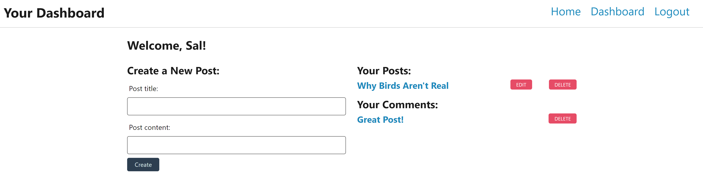

# Model-View-Controller (MVC): Tech Blog

## Purpose

The purpose of this project was to create an interactive blog where users can interact with each other by creating posts and adding comments to the posts on the site.

Some features of the site are:

- The user is able to create an account and log into the site.
  - User passwords are secured using bcrypt.
  - When the user creates an account they are taken to their dashboard where they can view/delete their comments/posts.
  - The user is logged out automatically after ten minutes of inactivity.
  - When viewing a post while logged in the user can choose to add a comment.
- The user is able to view all posts on the site whether they are logged in or not.
- All information for users, posts, and comments is stored remotely using SQL/Sequelize.

- Coming Soon: The user will be able to edit their posts/comments

The blog can be found at: https://thawing-tor-30912.herokuapp.com/

---

## Appearance

### Here is an example the landing page when first visiting the site:

### Here is an example the login page:

### Here is an example the dashboard once the user logs in:

### Here is an example viewing a post while logged in:

